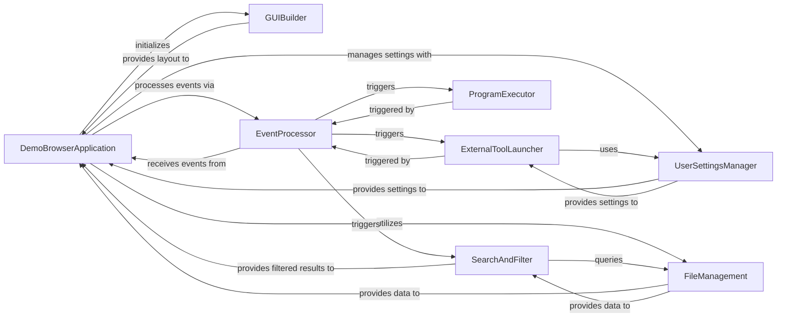

## Component Details

One paragraph explaining the functionality which is represented by this graph. What the main flow is and what is its purpose.

### DemoBrowserApplication

This is the core orchestrator of the Demo Program Browser. It is responsible for initializing the main GUI window, managing the application's event loop, and coordinating interactions between all other components. It acts as the central hub for the user's interaction with the demo programs, including receiving filtered data for UI updates. It's fundamental because it defines the application's lifecycle and overall flow.

**Related Classes/Methods**:

- <a href="https://github.com/PySimpleGUI/PySimpleGUI/blob/master/DemoPrograms/Browser_START_HERE_Demo_Programs_Browser.py#L1-L1" target="_blank" rel="noopener noreferrer">`DemoPrograms/Browser_START_HERE_Demo_Programs_Browser.py` (1:1)</a>

### GUIBuilder

This component is dedicated to constructing the visual layout of the Demo Program Browser's main window. It defines and arranges all PySimpleGUI elements, such as listboxes for demo files, input fields for search and filter, buttons for actions (Run, Edit, Settings), and status indicators. It's fundamental as it provides the user interface, making the application interactive and usable.

**Related Classes/Methods**:

- <a href="https://github.com/PySimpleGUI/PySimpleGUI/blob/master/DemoPrograms/Browser_START_HERE_Demo_Programs_Browser.py#L1-L1" target="_blank" rel="noopener noreferrer">`DemoPrograms/Browser_START_HERE_Demo_Programs_Browser.py` (1:1)</a>

### EventProcessor

This component is responsible for capturing and interpreting user interactions (events) within the Demo Program Browser's GUI. It reads events from the PySimpleGUI window and dispatches them to the appropriate handlers or components for further processing. It's fundamental because it enables the application to respond to user input, driving all interactive features.

**Related Classes/Methods**:

- <a href="https://github.com/PySimpleGUI/PySimpleGUI/blob/master/DemoPrograms/Browser_START_HERE_Demo_Programs_Browser.py#L1-L1" target="_blank" rel="noopener noreferrer">`DemoPrograms/Browser_START_HERE_Demo_Programs_Browser.py` (1:1)</a>

### FileManagement

This component handles all operations related to discovering, listing, and providing access to the demo program files within the specified directory. It manages the logic for retrieving file names and their full paths, including handling duplicate file names. It's fundamental as the application's core purpose is to browse these files.

**Related Classes/Methods**:

- <a href="https://github.com/PySimpleGUI/PySimpleGUI/blob/master/DemoPrograms/Browser_START_HERE_Demo_Programs_Browser.py#L1-L1" target="_blank" rel="noopener noreferrer">`DemoPrograms/Browser_START_HERE_Demo_Programs_Browser.py` (1:1)</a>

### UserSettingsManager

This component is responsible for managing the application's configuration and user preferences. It handles loading and saving settings such as the default demo folder, the path to the external editor, and the "advanced mode" setting, ensuring persistence across sessions. It's fundamental for user customization and maintaining application state.

**Related Classes/Methods**:

- <a href="https://github.com/PySimpleGUI/PySimpleGUI/blob/master/DemoPrograms/Browser_START_HERE_Demo_Programs_Browser.py#L1-L1" target="_blank" rel="noopener noreferrer">`DemoPrograms/Browser_START_HERE_Demo_Programs_Browser.py` (1:1)</a>

### SearchAndFilter

This component provides the functionality to narrow down the list of demo programs. It supports filtering by filename and performing content-based searches within the source code of the demo files, utilizing regular expressions for advanced searches. After processing, it provides the filtered results to the `DemoBrowserApplication` for display. It's fundamental for efficient navigation and discovery within a large set of demo programs.

**Related Classes/Methods**:

- <a href="https://github.com/PySimpleGUI/PySimpleGUI/blob/master/DemoPrograms/Browser_START_HERE_Demo_Programs_Browser.py#L1-L1" target="_blank" rel="noopener noreferrer">`DemoPrograms/Browser_START_HERE_Demo_Programs_Browser.py` (1:1)</a>

### ProgramExecutor

This component is responsible for executing the selected demo program. When a user chooses to run a demo, this component initiates the execution of the corresponding Python script, typically by invoking system commands. It's fundamental as it enables users to directly interact with and see the demos in action.

**Related Classes/Methods**:

- <a href="https://github.com/PySimpleGUI/PySimpleGUI/blob/master/DemoPrograms/Browser_START_HERE_Demo_Programs_Browser.py#L1-L1" target="_blank" rel="noopener noreferrer">`DemoPrograms/Browser_START_HERE_Demo_Programs_Browser.py` (1:1)</a>

### ExternalToolLauncher

This component facilitates opening the selected demo program in an external text editor or revealing its location in the system's file explorer. It leverages the editor and explorer paths configured in the user settings. It's fundamental for allowing users to inspect and modify the demo source code or manage the files directly.

**Related Classes/Methods**:

- <a href="https://github.com/PySimpleGUI/PySimpleGUI/blob/master/DemoPrograms/Browser_START_HERE_Demo_Programs_Browser.py#L1-L1" target="_blank" rel="noopener noreferrer">`DemoPrograms/Browser_START_HERE_Demo_Programs_Browser.py` (1:1)</a>

### [FAQ](https://github.com/CodeBoarding/GeneratedOnBoardings/tree/main?tab=readme-ov-file#faq)