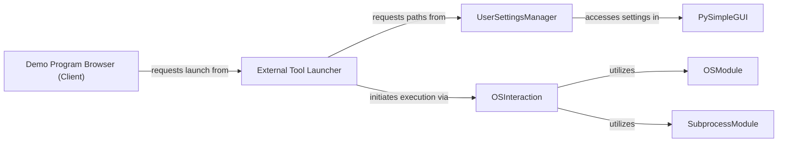

## Component Details

One paragraph explaining the functionality which is represented by this graph. What the main flow is and what is its purpose.

### External Tool Launcher

This component orchestrates the process of launching external applications, such as text editors for source files or file explorers for directories. It acts as an intermediary, retrieving the configured paths for these tools and then initiating their execution.

**Related Classes/Methods**:

- <a href="https://github.com/PySimpleGUI/PySimpleGUI/blob/master/DemoPrograms/psgdemos.py#L1-L1" target="_blank" rel="noopener noreferrer">`DemoPrograms/psgdemos.py` (1:1)</a>

- <a href="https://github.com/PySimpleGUI/PySimpleGUI/blob/master/DemoPrograms/Browser_START_HERE_Demo_Programs_Browser.py#L1-L1" target="_blank" rel="noopener noreferrer">`DemoPrograms/Browser_START_HERE_Demo_Programs_Browser.py` (1:1)</a>

### UserSettingsManager

Responsible for retrieving user-defined settings, specifically the file paths for the preferred external text editor and file explorer. It interacts with the `PySimpleGUI` library's user settings mechanism to fetch these configurations.

**Related Classes/Methods**:

- <a href="https://github.com/PySimpleGUI/PySimpleGUI/blob/master/DemoPrograms/psgdemos.py#L1-L1" target="_blank" rel="noopener noreferrer">`DemoPrograms/psgdemos.py:get_editor` (1:1)</a>

- <a href="https://github.com/PySimpleGUI/PySimpleGUI/blob/master/DemoPrograms/psgdemos.py#L1-L1" target="_blank" rel="noopener noreferrer">`DemoPrograms/psgdemos.py:get_explorer` (1:1)</a>

### OSInteraction

This component provides a low-level interface for interacting with the operating system. It encapsulates the actual calls to system commands or functions (like `os.startfile` or `subprocess.run`) required to launch external applications or open directories.

**Related Classes/Methods**:

- `os` (1:1)

- `subprocess` (1:1)

### PySimpleGUI

The underlying GUI library that provides the framework for the application's user interface. It also offers mechanisms for managing and persisting user settings, which are crucial for the `UserSettingsManager` to retrieve tool paths.

**Related Classes/Methods**:

- `PySimpleGUI` (1:1)

### OSModule

Python's standard library module that provides a portable way of using operating system-dependent functionality. In this context, it's used by `OSInteraction` for functions like `os.startfile` to open files or directories using their default associated applications.

**Related Classes/Methods**:

- `os` (1:1)

### SubprocessModule

Python's standard library module for spawning new processes, connecting to their input/output/error pipes, and obtaining their return codes. It's used by `OSInteraction` for more controlled execution of external programs, especially when specific arguments or environment settings are needed.

**Related Classes/Methods**:

- `subprocess` (1:1)

### Demo Program Browser (Client)

This is the main application component that initiates requests to open demo program source files in an external editor or to open the directory containing a demo program in the system's file explorer. It acts as the user-facing interface that triggers the external tool launching process.

**Related Classes/Methods**:

- <a href="https://github.com/PySimpleGUI/PySimpleGUI/blob/master/DemoPrograms/Browser_START_HERE_Demo_Programs_Browser.py#L1-L1" target="_blank" rel="noopener noreferrer">`DemoPrograms/Browser_START_HERE_Demo_Programs_Browser.py` (1:1)</a>

### [FAQ](https://github.com/CodeBoarding/GeneratedOnBoardings/tree/main?tab=readme-ov-file#faq)