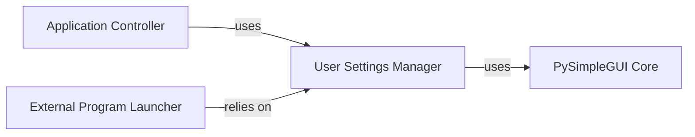

## Component Details

The User Settings Manager is fundamental because it centralizes all logic related to user preferences, ensuring that the application's behavior is tailored to individual user choices. By abstracting the direct calls to PySimpleGUI's settings API, it makes the rest of the application cleaner and more focused on its core tasks, rather than on the specifics of settings persistence. This separation of concerns allows for easy modification of how settings are stored or retrieved without impacting other components. Its role in providing consistent access to user-defined paths for external tools (editor, explorer) and application modes (advanced mode) is crucial for the overall user experience and functionality of the Demo Program Browser.

### User Settings Manager

This component is dedicated to managing the persistence and retrieval of user-specific configurations and preferences for the Demo Program Browser. It provides a unified interface for accessing settings such as the preferred demo folder, the path to an external text editor, the file explorer, and display options like "advanced mode." It intelligently prioritizes user-defined settings over global PySimpleGUI defaults when applicable, abstracting the direct interaction with PySimpleGUI's underlying user settings storage mechanism.

**Related Classes/Methods**:

- <a href="https://github.com/PySimpleGUI/PySimpleGUI/blob/master/DemoPrograms/psgdemos.py#L0-L0" target="_blank" rel="noopener noreferrer">`psgdemos.get_demo_path` (0:0)</a>

- <a href="https://github.com/PySimpleGUI/PySimpleGUI/blob/master/DemoPrograms/psgdemos.py#L0-L0" target="_blank" rel="noopener noreferrer">`psgdemos.get_global_editor` (0:0)</a>

- <a href="https://github.com/PySimpleGUI/PySimpleGUI/blob/master/DemoPrograms/psgdemos.py#L0-L0" target="_blank" rel="noopener noreferrer">`psgdemos.get_editor` (0:0)</a>

- <a href="https://github.com/PySimpleGUI/PySimpleGUI/blob/master/DemoPrograms/psgdemos.py#L0-L0" target="_blank" rel="noopener noreferrer">`psgdemos.using_local_editor` (0:0)</a>

- <a href="https://github.com/PySimpleGUI/PySimpleGUI/blob/master/DemoPrograms/psgdemos.py#L0-L0" target="_blank" rel="noopener noreferrer">`psgdemos.get_explorer` (0:0)</a>

- <a href="https://github.com/PySimpleGUI/PySimpleGUI/blob/master/DemoPrograms/psgdemos.py#L0-L0" target="_blank" rel="noopener noreferrer">`psgdemos.advanced_mode` (0:0)</a>

- `sg.user_settings_get_entry` (0:0)

- `sg.pysimplegui_user_settings.get` (0:0)

- `sg.user_settings_set_entry` (0:0)

### PySimpleGUI Core

Provides core functionalities and APIs for PySimpleGUI applications, including user settings management.

**Related Classes/Methods**: _None_

### Application Controller

Manages the overall application flow, GUI initialization, file operations, and user interactions.

**Related Classes/Methods**: _None_

### External Program Launcher

Responsible for launching external programs like text editors or file explorers based on user configurations.

**Related Classes/Methods**: _None_

### [FAQ](https://github.com/CodeBoarding/GeneratedOnBoardings/tree/main?tab=readme-ov-file#faq)