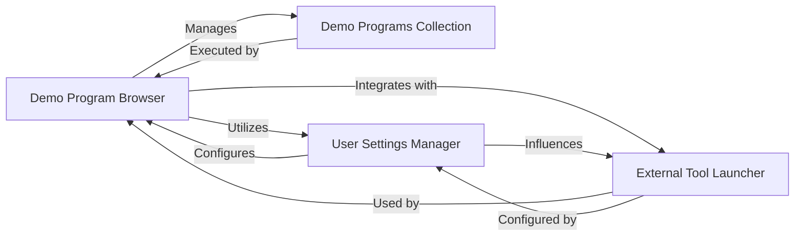

## Component Details

The analysis of the file structure reveals that the current repository is primarily focused on DemoPrograms for PySimpleGUI, rather than the core PySimpleGUI library itself. This means the PySimpleGUI Library and Underlying GUI Frameworks are external dependencies to this project. Based on this understanding and the provided abstract components, the critical interaction pathways and central modules within this demo project are centered around the Demo Program Browser and its management of the Demo Programs. The PySimpleGUI Library and Underlying GUI Frameworks were excluded as primary components of this project because the file structure indicates they are external dependencies, not part of the source code managed within this specific repository. While crucial for the functionality of the demos, they are not developed or maintained within this project's scope. 'File System Utilities' was absorbed into 'System Interaction Utilities' (renamed to 'External Tool Launcher' for clarity) and the 'Demo Program Browser' itself, as its functions are primarily in support of these higher-level interactions.

### Demo Program Browser

This is the central application of the repository. It provides a graphical user interface for users to browse, filter, search, run, and edit the various PySimpleGUI demo programs. It acts as the primary entry point for exploring the library's capabilities through its examples.

**Related Classes/Methods**:

- <a href="https://github.com/PySimpleGUI/PySimpleGUI/blob/master/DemoPrograms/Browser_START_HERE_Demo_Programs_Browser.py#L-1-L-1" target="_blank" rel="noopener noreferrer">`Browser_START_HERE_Demo_Programs_Browser.py` (-1:-1)</a>

- <a href="https://github.com/PySimpleGUI/PySimpleGUI/blob/master/DemoPrograms/psgdemos.py#L-1-L-1" target="_blank" rel="noopener noreferrer">`psgdemos.py` (-1:-1)</a>

### Demo Programs Collection

This component represents the extensive set of individual Python scripts, each designed to showcase a specific feature, element, or design pattern of the PySimpleGUI library. These are the executable examples that demonstrate the library's functionality.

**Related Classes/Methods**:

- <a href="https://github.com/PySimpleGUI/PySimpleGUI/blob/master/DemoPrograms/Demo_All_Elements.py#L-1-L-1" target="_blank" rel="noopener noreferrer">`Demo_All_Elements.py` (-1:-1)</a>

- <a href="https://github.com/PySimpleGUI/PySimpleGUI/blob/master/DemoPrograms/Demo_Hello_World.py#L-1-L-1" target="_blank" rel="noopener noreferrer">`Demo_Hello_World.py` (-1:-1)</a>

- <a href="https://github.com/PySimpleGUI/PySimpleGUI/blob/master/DemoPrograms/Demo_Matplotlib_Embedded_TEMPLATE.py#L-1-L-1" target="_blank" rel="noopener noreferrer">`Demo_Matplotlib_Embedded_TEMPLATE.py` (-1:-1)</a>

### User Settings Manager

This component is responsible for handling the persistence of user-specific configurations and preferences for the Demo Program Browser. This includes saving and loading settings such as the preferred demo folder, the path to an external text editor, and other display options.

**Related Classes/Methods**:

- <a href="https://github.com/PySimpleGUI/PySimpleGUI/blob/master/DemoPrograms/Browser_START_HERE_Demo_Programs_Browser.py#L-1-L-1" target="_blank" rel="noopener noreferrer">`Browser_START_HERE_Demo_Programs_Browser.py` (-1:-1)</a>

- <a href="https://github.com/PySimpleGUI/PySimpleGUI/blob/master/DemoPrograms/psgdemos.py#L-1-L-1" target="_blank" rel="noopener noreferrer">`psgdemos.py` (-1:-1)</a>

### External Tool Launcher

This component provides the functionality to interact with the operating system by launching external applications. Specifically, it enables the Demo Program Browser to open demo program source files in a user-defined external text editor or to open the directory containing a demo program in the system's file explorer.

**Related Classes/Methods**:

- <a href="https://github.com/PySimpleGUI/PySimpleGUI/blob/master/DemoPrograms/Browser_START_HERE_Demo_Programs_Browser.py#L-1-L-1" target="_blank" rel="noopener noreferrer">`Browser_START_HERE_Demo_Programs_Browser.py` (-1:-1)</a>

- <a href="https://github.com/PySimpleGUI/PySimpleGUI/blob/master/DemoPrograms/psgdemos.py#L-1-L-1" target="_blank" rel="noopener noreferrer">`psgdemos.py` (-1:-1)</a>

### [FAQ](https://github.com/CodeBoarding/GeneratedOnBoardings/tree/main?tab=readme-ov-file#faq)